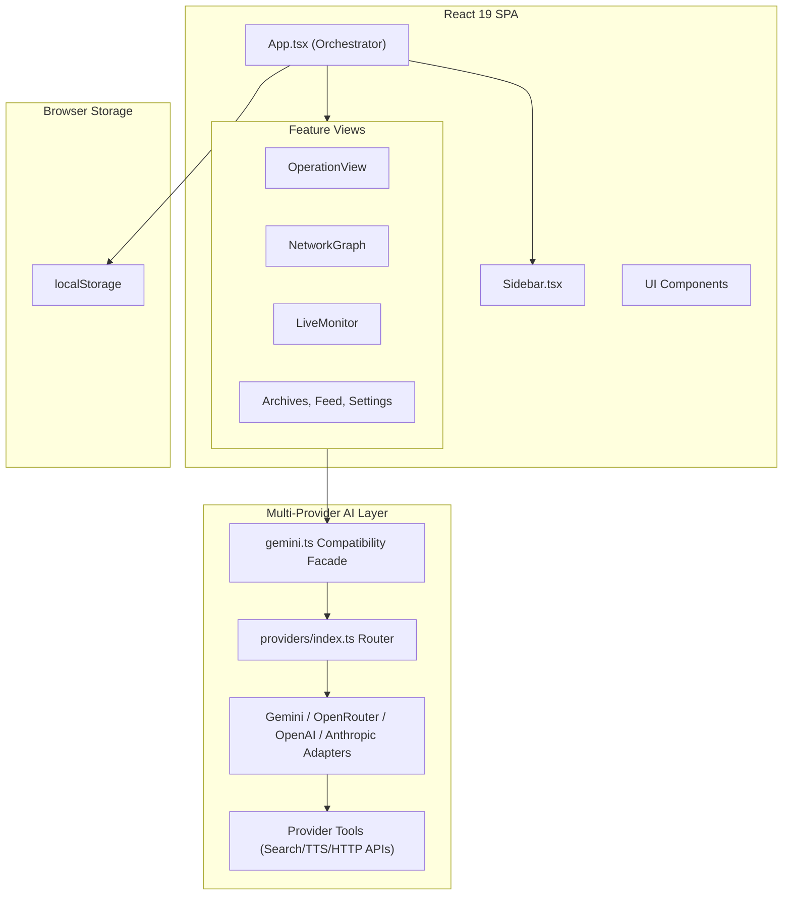
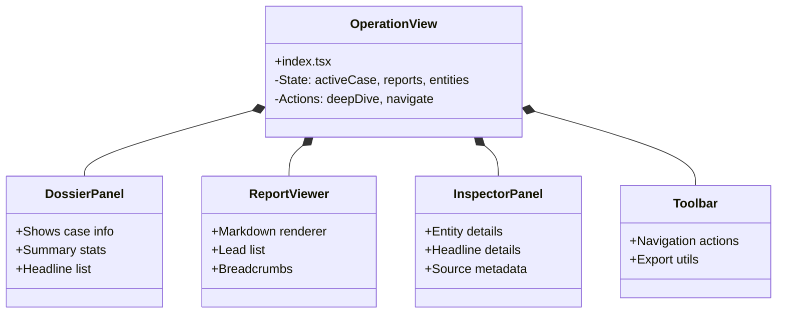
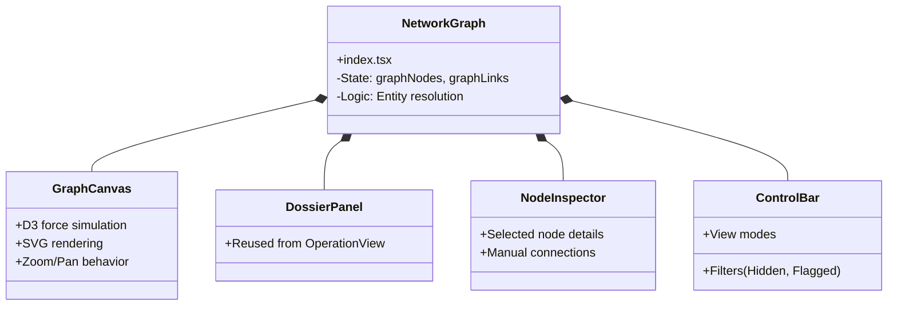
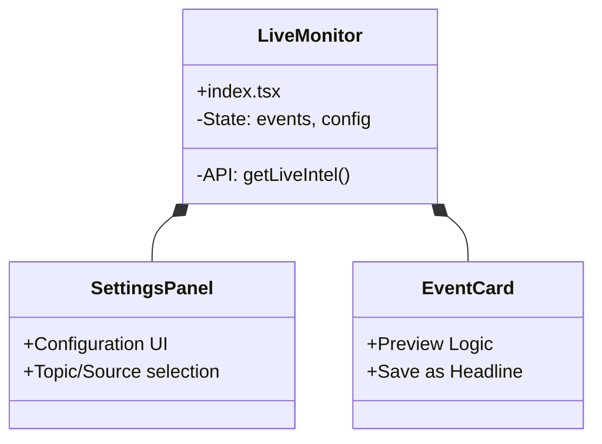
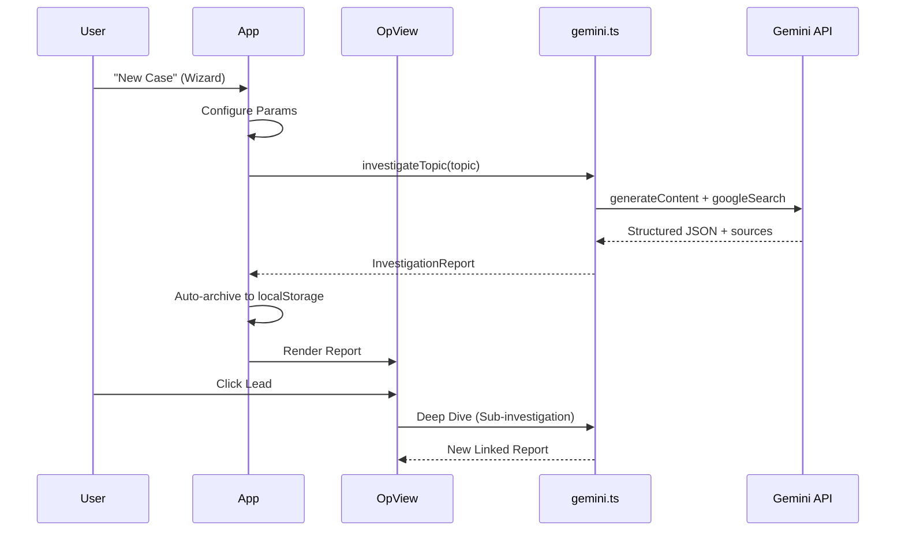

# Sherlock AI – Systems & Architecture

> A concise technical reference for the OSINT investigation platform.

---

## High-Level Architecture



---

## Provider Runtime (Phase 3/4)

- `src/services/providers/types.ts` defines the normalized provider contracts used by all AI operations.
- `src/services/providers/shared/` contains cross-provider parsing, normalization, retry, logging, and error mapping utilities.
- `src/services/providers/index.ts` is the provider router/registry and enforces capability checks by operation.
- `src/services/gemini.ts` remains the app-facing API surface but now delegates to router operations.
- Adapters currently implemented: `geminiProvider`, `openRouterProvider`, `openAIProvider`, `anthropicProvider`.

## Mobile & Responsive Strategy

The application implements a "Mobile-Overlay" pattern to handle complex information density on small screens.

### Breakpoints

- **Mobile (< 768px)**: Optimized for touch, reduced information density.
- **Tablet (< 1024px)**: Sidebar automatically collapses.
- **Desktop (≥ 1024px)**: Full 3-panel layouts and persistent sidebar.

### UI Patterns

1. **Sidebar Navigation**:
   - Fixed width on desktop.
   - Collapses to icon-only or hidden drawer on mobile.
2. **Operation View Panels**:
   - **Desktop**: Relative positioning, sharing space (33/33/33 or 20/60/20).
   - **Mobile**: Absolute/Fixed positioning (Overlays). Panels slide in over the main content with a backdrop to maintain focus and maximize readable area.
3. **Feed Filters**:
   - **Desktop**: Inline filters in sticky header.
   - **Mobile**: Dedicated overlay panel triggered by filter button to save header space.

---

## Component Decomposition

### Operation View (Command Center)



### Network Graph (Visualization)



### Node Types

| Type | Visual | Source |
|------|--------|--------|
| CASE | Square | Investigation topics |
| ENTITY (PERSON) | Circle solid | AI-extracted |
| ENTITY (ORG) | Circle outline | AI-extracted |
| Manual | Dashed border | User-created |
| Flagged | Star indicator | User-flagged |

### Interactions

- **Click node**: Open dossier panel with summary, neighbors, mentions
- **Shift+Click two nodes**: Create manual connection
- **Right-click**: Delete node
- **Flag toggle**: Mark entity as "of interest"
- **Deep Scan**: Launch sub-investigation on entity
- **Show/Hide Hidden**: Toggle visibility of hidden nodes

---

## LiveMonitor.tsx – Real-Time Intelligence

### Features

- Streaming intel (NEWS/SOCIAL/OFFICIAL)
- Source type filters
- Sentiment badges
- Priority sources configuration
- Date range filtering

### Headline Persistence

- Click event → Expand preview
- "Save as Headline" → Persists to case
- Headlines stored in `sherlock_headlines`
- Headlines appear in OperationView dossier

---

## TaskSetupModal.tsx – Investigation Wizard

### Steps

| Step | Name | Fields |
|------|------|--------|
| 1 | **Target** | Primary investigation topic |
| 2 | **Hypothesis** | Working theory (optional) |
| 3 | **Key Figures** | Pre-seed entity names (PERSON/ORG) |
| 4 | **Sources** | Priority domains to use |
| 5 | **Config** | Persona, scan depth, model |

### Pre-seeded Entities

Key figures entered in step 3 are converted to `ManualNode[]` and added to the graph upon investigation completion.

---

## Export Utilities (exportUtils.ts)

| Function | Description |
|----------|-------------|
| `exportCaseAsJson()` | Full case with all reports as JSON |
| `exportReportAsJson()` | Single report as JSON |
| `exportCaseAsHtml()` | Styled HTML dossier with all reports |
| `exportReportAsHtml()` | Single report as styled HTML |

### HTML Export Features

- Professional styling with entity badges
- Print-optimized CSS
- Source links preserved
- Color-coded entity types

---

## Live Monitor (Intel Stream)



---

## Core Data Flow



---

## File Structure

```
src/
├── App.tsx                    # Root orchestrator
├── types/                     # TypeScript interfaces
├── utils/                     # Shared utilities (text, audio, localStorage)
├── components/
│   ├── ui/                    # Reusable UI primitives (Accordion, EmptyState)
│   └── features/              # Feature modules
│       ├── OperationView/     # Main workspace components
│       │   ├── index.tsx      # Orchestrator
│       │   ├── DossierPanel.tsx
│       │   ├── ReportViewer.tsx
│       │   ├── InspectorPanel.tsx
│       │   └── Toolbar.tsx
│       ├── NetworkGraph/      # Graph visualization components
│       │   ├── index.tsx      # Orchestrator
│       │   ├── GraphCanvas.tsx
│       │   ├── NodeDossier.tsx
│       │   └── NodeInspector.tsx
│       ├── LiveMonitor/       # Intel stream components
│       │   ├── index.tsx
│       │   ├── EventCard.tsx
│       │   └── SettingsPanel.tsx
│       ├── Archives.tsx       # Case file browser
│       ├── Feed.tsx           # Dashboard/Finder
│       └── Settings.tsx       # System configuration
└── services/
    └── gemini.ts              # Gemini AI integration
```

---

## Core Interfaces

| Interface | Purpose |
|-----------|---------|
| `InvestigationReport` | Primary output: summary, entities, agendas, leads, sources |
| `Entity` | Person/Org extracted from AI analysis with sentiment |
| `Case` | Container grouping multiple reports and headlines |
| `Headline` | Persisted live intel item with status tracking |
| `LeadStatus` | Status enum: `PENDING`, `INVESTIGATED`, `FLAGGED` |
| `InvestigationTask` | Async task with status (QUEUED/RUNNING/COMPLETED/FAILED) |
| `MonitorEvent` | Live intel item (NEWS/SOCIAL/OFFICIAL) |
| `FeedItem` | Dashboard anomaly alert with risk level |
| `SystemConfig` | Model ID, thinking budget, persona, search depth |
| `ManualConnection` / `ManualNode` | User-created graph elements |
| `EntityAliasMap` | Alias → canonical entity mappings |
| `BreadcrumbItem` | Navigation trail item with id/label |

---

## Gemini Service (gemini.ts)

### Functions

| Function | Description |
|----------|-------------|
| `investigateTopic()` | Deep OSINT investigation with persona/search depth config. Returns `InvestigationReport`. |
| `scanForAnomalies()` | Scans for trending fraud/waste topics. Returns `FeedItem[]`. |
| `getLiveIntel()` | Streams real-time intel for a case. Returns `MonitorEvent[]`. |
| `generateAudioBriefing()` | TTS via `gemini-2.5-flash-preview-tts`. Returns base64 PCM audio. |

### Key Design Patterns

1. **Model Compatibility Layer**
    - Gemini 2.5 `isModel25()` check triggers prompt-based JSON fallback.
2. **Config Cascading**
    - `DEFAULT_CONFIG → localStorage → per-call override`
3. **Grounded Search**
    - All AI calls use `tools: [{ googleSearch: {} }]`.
4. **Priority Sources**
    - Configurable per-investigation source preferences.

---

## App.tsx – State Management

### Primary State

```typescript
currentView: AppView           // Active view enum
currentReport: InvestigationReport | null
archives: InvestigationReport[]
cases: Case[]
tasks: InvestigationTask[]     // useReducer for async queue
navStack: BreadcrumbItem[]     // Navigation history
```

### Task Queue (useReducer)

| Action | Effect |
|--------|--------|
| `ADD_TASK` | Spawns async investigation, sets status QUEUED→RUNNING |
| `COMPLETE_TASK` | Attaches report, auto-archives |
| `FAIL_TASK` | Captures error message |
| `CLEAR_COMPLETED` | Removes finished tasks |

### Auto-Archive Logic

`autoArchiveReport()` runs post-investigation:

1. Generates unique ID
2. Links to active case (if any)
3. Persists to `sherlock_archives` in localStorage

### Navigation Stack

`navStack: BreadcrumbItem[]` maintains navigation history for breadcrumb trail.

---

## OperationView.tsx – Primary Workspace

### Layout (Three-Panel)

```
┌─────────────────────────────────────────────────────────────────────────────┐
│  Toolbar: Case Title | New Case | Export | Voice Briefing                   │
├──────────────┬────────────────────────────────────────────┬─────────────────┤
│              │        Breadcrumbs                         │                 │
│              ├────────────────────────────────────────────┤                 │
│   Dossier    │                                            │   Inspector     │
│   Panel      │          Report Viewer                     │   Panel         │
│   (Left)     │          (Center)                          │   (Right)       │
│              │                                            │                 │
└──────────────┴────────────────────────────────────────────┴─────────────────┘
```

### Left Panel: Case Dossier

- Active case info and description
- Investigation count and timeline
- Key entities list
- Headlines (persisted live intel)
- Collapsible sections

### Center Panel: Report Viewer

- Full report with executive summary
- Leads list with investigate buttons
- Markdown rendering with entity highlighting
- Navigation breadcrumbs

### Right Panel: Inspector

- Context-sensitive information
- Entity details with connections and mentions
- Headline details with investigation option
- Collapsible accordion sections

---

## NetworkGraph.tsx – Visualization Engine

### Stack

- **D3.js v7** force simulation
- SVG rendering with zoom/pan

### Graph Construction

1. **Node Types**
   - CASE: Square, Investigation topics
   - ENTITY (PERSON): Circle solid, AI-extracted
   - ENTITY (ORG): Circle outline, AI-extracted
   - Manual: Dashed border, User-created
   - Flagged: Star indicator, User-flagged

2. **Interactions**
   - Click node: Open dossier panel with summary, neighbors, mentions
   - Shift+Click two nodes: Create manual connection
   - Right-click: Delete node
   - Flag toggle: Mark entity as "of interest"
   - Deep Scan: Launch sub-investigation on entity
   - Show/Hide Hidden: Toggle visibility of hidden nodes

---

## Storage Schema

All data persisted to `localStorage` (prefix `sherlock_`):

| Key | Content |
|-----|---------|
| `sherlock_archives` | `InvestigationReport[]` |
| `sherlock_cases` | `Case[]` |
| `sherlock_headlines` | `Headline[]` |
| `sherlock_manual_links` | `ManualConnection[]` |
| `sherlock_manual_nodes` | `ManualNode[]` |
| `sherlock_entity_aliases` | `EntityAliasMap` |
| `sherlock_flagged_nodes` | Flagged entity IDs |
| `sherlock_hidden_nodes` | Hidden node IDs |
| `sherlock_config` | `SystemConfig` |
| `sherlock_active_case_id` | Currently selected case |

---

## View Components

| View | Key Features |
|------|--------------|
| **OperationView** | Primary 3-panel workspace, breadcrumbs, entity inspector, headline management |
| **Feed** | Finder/dashboard with `scanForAnomalies()`, Target Acquisition input, category filters |
| **NetworkGraph** | D3 force graph, entity flagging, dossier panel, manual node creation |
| **LiveMonitor** | Streaming intel, source filters, headline persistence, settings panel |
| **Archives** | Report list, case grouping, export dropdown (HTML/JSON), delete |
| **Settings** | Model selection, thinking budget slider, persona picker, data management |
| **EntityResolution** | Alias table, merge/split entities, bulk operations |
| **Investigation** | Legacy report display (superseded by OperationView) |

---

## Configuration Options

| Setting | Values |
|---------|--------|
| **Model** | gemini-3-flash-preview, gemini-3-pro-preview, gemini-2.5-flash, gemini-2.5-pro, gemini-2.5-lite |
| **Thinking Budget** | 0–16,384 tokens |
| **Persona** | FORENSIC_ACCOUNTANT, JOURNALIST, INTELLIGENCE_OFFICER, CONSPIRACY_ANALYST |
| **Search Depth** | STANDARD, DEEP (prioritizes obscure sources) |

---

## Security & Safety

- API key stored **locally only** (never transmitted to third parties)
- Permissive safety settings for OSINT research (`BLOCK_ONLY_HIGH`)
- No server-side component – fully client-side SPA

---

*Last Updated: January 2026*
